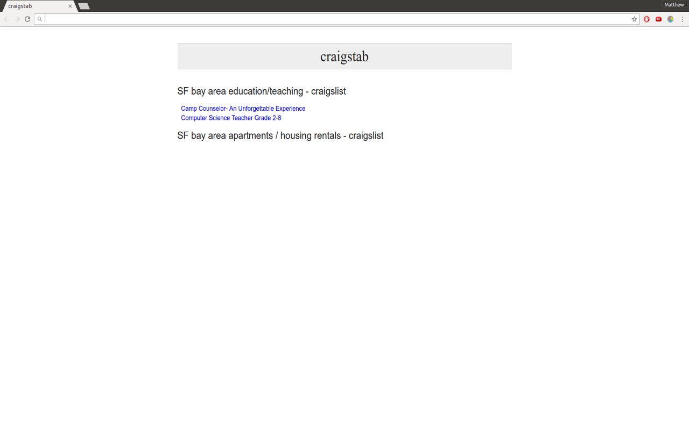

# craigstab

This is a Google Chrome extension that replaces Chrome's new tab page with a page that displays
links for user specified searches on craigslist. Users can add or delete craigslist searches from
an options page (accessible from the craigstab toolbar icon), or save any craigslist search that
is currently open (also accessible from the craigstab icon). Any craigslist post made within the last
day that match the user's specifications are then posted on the new tab page (limited to 100 results).

[craigstab webstore page](https://chrome.google.com/webstore/detail/craigstab/kdgbcogcnaebkjpanokfcgclahodnedh)



## Technologies

craigstab uses the Google Chrome API, jQuery, and vanilla JavaScript. Most DOM manipulation
is done with vanilla JavaScript, and the ajax calls are made with jQuery (some DOM manipulation
is done with jQuery as well).

## Implementation

The most interesting part of this project was getting results from craigslist. This was accomplished
with the following code:

```
$(document).ready(() => {
  chrome.storage.sync.get('rules', (store) => {
    Object.keys(store.rules).forEach((rule, idx) => {
      $("#rules").append(`<li id="rule${idx}"><h3 id="title${idx}"></h3><ul class="rule-list" id="rule-list${idx}"></ul></li>`);
      let pattern = new RegExp("\\\?");
      let newRule;
      if (pattern.test(rule)) {
        newRule = rule + "&postedToday=1";
      } else {
        newRule = rule + "?postedToday=1"
      }
      $.ajax({
        url: newRule,
        method: "GET",
        success: (data) => {
          console.log($(data)[1]);
          $(`#title${idx}`).append($(data)[1].innerHTML);
          $(`#rule-list${idx}`).append($(data).find(".hdrlnk"));
          $(`#rule-list${idx} .hdrlnk`).each((idx, el) => {
            $(el).attr("href", "http://craigslist.org" + $(el).attr("href"));
            $(el).wrap("<li class='rule'></li>")
          });
        }
      });
    });
  });
});
```

This code iterates through the rules set by the user and adds html to the tab for each rule.
The RegEx pattern checks if the user specified any parameters with their search to see if an
ampersand or question mark should be attached, so that results can be limited to today.
Then an ajax request gets the content from craigslist, takes the relative link, and puts it
onto the new tab.
